# 👋 Hey, I'm Rajan Nelson

<div align="center">
  
[](https://git.io/typing-svg)

</div>

## 🚀 About Me

```python
class Rajan:
    def __init__(self):
        self.username = "TheRaj2005"
        self.location = "GCU 📍"
        self.education = "Information Systems Student"
        self.interests = ["Data Analytics", "Python", "Technology"]
        self.currently_learning = ["Data Structures", "File Management", "Text Processing"]
        self.goal = "Master Data Analytics & Technology"
    
    def say_hi(self):
        print("Thanks for dropping by! Let's build something amazing together 🚀")

me = Rajan()
me.say_hi()
```

## 💻 Tech Stack

<div align="center">


</div>

## 📊 GitHub Stats

<div align="center">
  


</div>

## 🎯 Current Focus

```mermaid
graph LR
    A[📚 Learning] --> B[Python Projects]
    B --> C[Data Analysis]
    C --> D[File Management]
    D --> E[🎓 Mastery]
    style A fill:#00D9FF,stroke:#00D9FF,color:#000
    style E fill:#00D9FF,stroke:#00D9FF,color:#000
```



- 🔭 Working on: **Python Data Projects**
- 🌱 Learning: **Advanced Python techniques & Data Structures**
- 💡 Building: **Reusable code functions and data processing tools**
- 🎯 Goal: **Become a Data Analytics expert**

## 🏆 Featured Projects

<div align="center">

[](https://github.com/TheRaj2005/learning-functions)

[](https://github.com/TheRaj2005/Python-Projects--File-Management-)

[](https://github.com/TheRaj2005/Python-Projects--Text-And-Data)

</div>

## 📈 Contribution Graph


## 💭 Dev Quote of the Day

<div align="center">


</div>

## 🤝 Let's Connect!

<div align="center">

[](mailto:TheRaj2005@outlook.com)
[](https://github.com/TheRaj2005)

</div>

---

<div align="center">
  
### 💡 *"Data is the new oil, and I'm learning to refine it!"*


⭐️ From [TheRaj2005](https://github.com/TheRaj2005)

</div>
