# 👋 Hey, I'm Rajan Nelson

<div align="center">
  
[](https://git.io/typing-svg)

</div>

## 🚀 About Me

```python
class Rajan:
    def __init__(self):
        self.username = "TheRaj2005"
        self.location = "GCU 📍"
        self.education = "Information Systems Student"
        self.interests = ["Data Analytics", "Python", "Technology"]
        self.currently_at = "POOP Stage 💩"  # Python Object-Oriented Programming!
        self.goal = "Master Data Analytics & Technology"
    
    def say_hi(self):
        print("Thanks for dropping by! Let's build something amazing together 🚀")

me = Rajan()
me.say_hi()
```

## 💻 Current Tech Stack

<div align="center">


</div>

## 🎯 My Learning Journey

```mermaid
graph TD
    A[📝 Text & Data] --> B[📁 File Management]
    B --> C[⚙️ Functions]
    C --> D[💩 POOP - Current Stage!]
    D --> E[📊 Statistics]
    E --> F[🔢 scikit, numpy, pandas]
    F --> G[📄 CSV & JSON Handling]
    G --> H[🌐 APIs]
    H --> I[📗 Excel Integration]
    I --> J[🎓 Data Analytics Master!]
    
    style D fill:#FFD700,stroke:#FFD700,color:#000,stroke-width:4px
    style J fill:#00D9FF,stroke:#00D9FF,color:#000
```

<div align="center">



</div>

### ✅ Completed
- ✨ Text and Data Processing
- ✨ File Management
- ✨ Functions

### 🔥 Currently Learning
- 💩 **POOP (Python Object-Oriented Programming)** - Building better code structure!

### 📚 Coming Up Next
- Statistics
- scikit-learn, NumPy & Pandas
- CSV & JSON Handling
- APIs
- Excel Integration

## 🏆 Featured Projects

<div align="center">

[](https://github.com/TheRaj2005/learning-functions)

[](https://github.com/TheRaj2005/Python-Projects--File-Management-)

[](https://github.com/TheRaj2005/Python-Projects--Text-And-Data)

[](https://github.com/TheRaj2005/POOP)

</div>

## 💡 Current Focus

```python
current_goals = {
    "learning": "Object-Oriented Programming in Python",
    "building": "Reusable classes and methods",
    "next_up": "Statistics and data analysis",
    "end_goal": "Full-stack data analytics toolkit"
}
```

## 🤝 Let's Connect!

<div align="center">

[](mailto:TheRaj2005@outlook.com)
[](https://github.com/TheRaj2005)

</div>

---

<div align="center">
  
## 💡 *"Every expert was once a beginner. Keep coding! 💻"*


⭐️ From [TheRaj2005](https://github.com/TheRaj2005)

</div>
